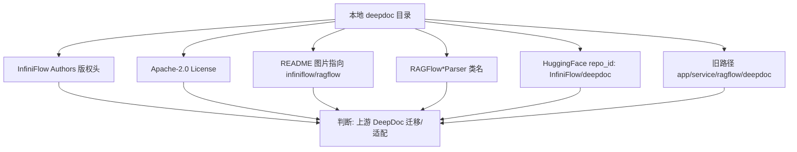
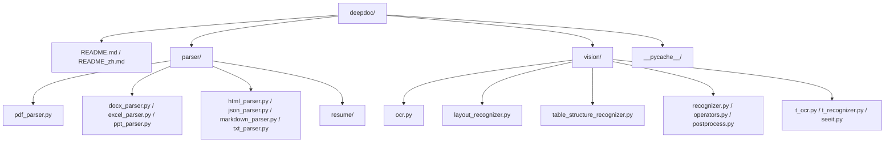
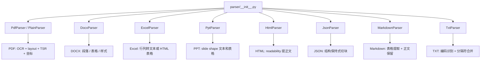
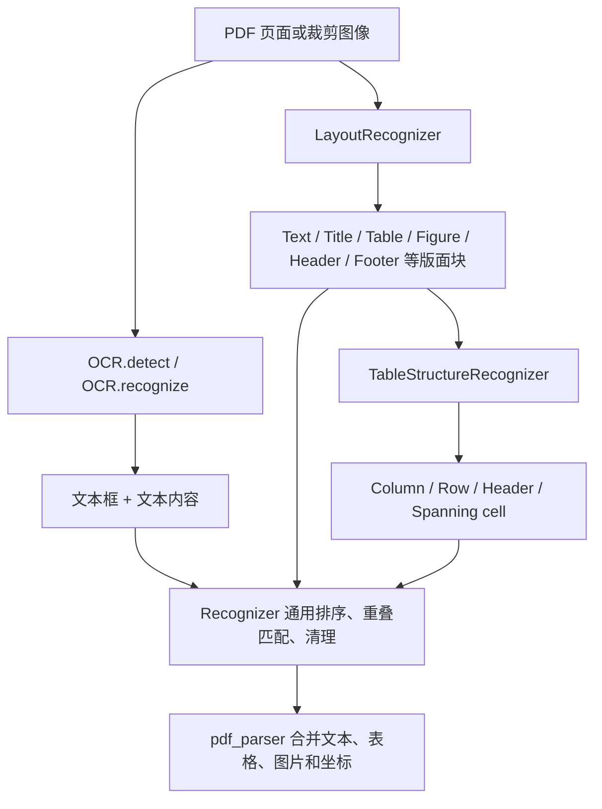
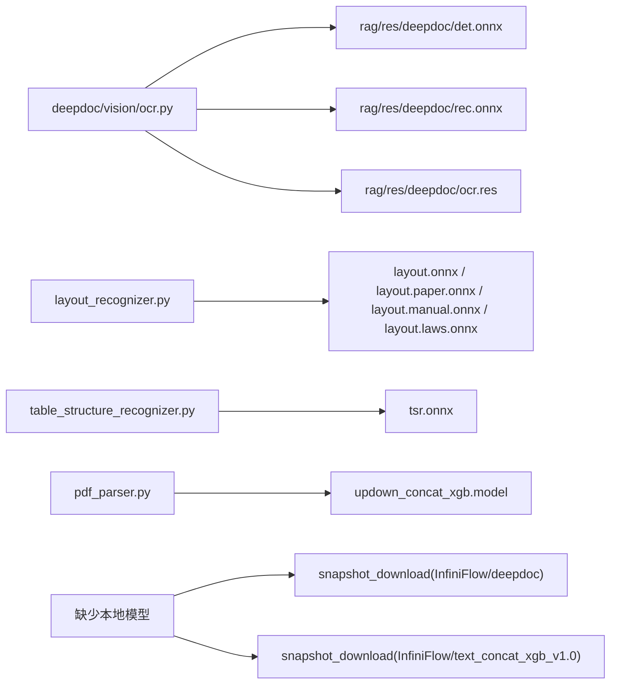

# DeepDOC 来源与目录拆解

本文分析 `backend/app/service/core/deepdoc` 的来源、目录结构和在本项目中的角色。

## 1. 来源结论

结论：这个目录不是本项目从零手写的模块，而是基于 InfiniFlow/RAGFlow 的 DeepDoc 代码迁移并做了项目内适配。

本地证据：

- 多数源码文件头包含 `Copyright 2025 The InfiniFlow Authors` 和 Apache-2.0 许可声明。
- `README.md` 与 `README_zh.md` 中的图片资源指向 `github.com/infiniflow/ragflow`。
- Parser 类名保留 `RAGFlowPdfParser`、`RAGFlowDocxParser`、`RAGFlowExcelParser` 等上游命名。
- 视觉模型会从 `InfiniFlow/deepdoc` 下载，段落上下文拼接模型会从 `InfiniFlow/text_concat_xgb_v1.0` 下载。
- 后端 git 历史中存在旧路径 `app/service/ragflow/deepdoc`，当前代码迁移到 `app/service/core/deepdoc`。

参考来源：

- [RAGFlow DeepDoc README](https://github.com/infiniflow/ragflow/blob/main/deepdoc/README.md)
- [RAGFlow GitHub 仓库](https://github.com/infiniflow/ragflow)
- [deepdoc_pdfparser PyPI](https://pypi.org/project/deepdoc-pdfparser/)

## 2. 目录结构

目录职责：

- `README.md` / `README_zh.md`：上游 DeepDoc 说明，介绍 OCR、版面识别、表格结构识别和 parser。
- `parser/`：多格式文档解析器，输出文本段落、表格内容、图片和位置等结构化结果。
- `vision/`：视觉推理能力，包含 OCR、版面识别、表格结构识别和后处理工具。
- `parser/resume/`：简历解析相关逻辑和实体资源，当前主解析链路未重点使用。
- `__pycache__/`：Python 运行缓存，不是业务源码。

## 3. Parser 子模块拆解

重点文件：

- `pdf_parser.py`：最核心也最复杂，负责 PDF 转图片、OCR、版面识别、表格结构识别、文本合并、表格/图片裁剪和位置 tag。
- `docx_parser.py`：读取 Word 段落、样式和表格，并把表格组合成更适合检索的文本。
- `excel_parser.py`：用 `openpyxl` 读取表格，支持普通文本行输出和 HTML 表格输出。
- `html_parser.py`：用 `readability` 和 `html_text` 提取网页正文。
- `json_parser.py`：借鉴 LangChain JSON splitter 思路，保持 JSON 层级进行切块。
- `markdown_parser.py`：识别标准 Markdown 表格和无边框表格。
- `txt_parser.py`：读取文本并按分隔符与 token 数合并。
- `ppt_parser.py`：读取 PPT slide 中的文本框、组合形状和表格。

## 4. Vision 子模块拆解

重点文件：

- `ocr.py`：OCR 检测和识别封装，加载 `det.onnx`、`rec.onnx`、`ocr.res` 等资源。
- `layout_recognizer.py`：版面识别，加载 `layout*.onnx` 模型，识别文本、标题、表格、图片等区域。
- `table_structure_recognizer.py`：表格结构识别，加载 `tsr.onnx`，识别行列、表头和合并单元格。
- `recognizer.py`：视觉识别器基类和通用后处理，包括排序、重叠匹配、布局清理。
- `operators.py` / `postprocess.py`：图像预处理、推理输出后处理、NMS 等基础能力。
- `t_ocr.py` / `t_recognizer.py` / `seeit.py`：上游测试和可视化辅助脚本。

## 5. 模型资源依赖

DeepDOC 代码本身约 2MB，但依赖的模型资源在 `backend/app/service/core/rag/res/deepdoc/`，本地约 321MB。

模型文件作用：

- `det.onnx`：OCR 文本检测。
- `rec.onnx`：OCR 文本识别。
- `layout*.onnx`：不同领域 PDF 的版面识别模型。
- `tsr.onnx`：表格结构识别模型。
- `updown_concat_xgb.model`：判断上下文本块是否应拼接的 XGBoost 模型。
- `ocr.res`：OCR 字典或相关识别资源。

## 6. 本项目适配痕迹

当前目录已经做过工程内适配：

- 多处 import 改为 `service.core.deepdoc.*`、`service.core.rag.*`、`service.core.api.utils.file_utils`。
- 模型默认加载路径改到 `service.core` 下的 `rag/res/deepdoc`。
- `deepdoc/parser/__init__.py` 暴露统一 parser 名称，供 `rag/app/naive.py::chunk()` 使用。

仍能看到的迁移痕迹：

- `parser/resume/step_one.py`、`parser/resume/step_two.py` 仍有 `from deepdoc...` 和 `from rag...` 风格 import。
- `vision/t_ocr.py`、`vision/t_recognizer.py` 仍按上游独立包方式导入 `deepdoc.vision...`。
- `README` 仍是上游介绍文档，没有改成本项目专属说明。

## 7. 面试讲法

可以这样说：

1. “DeepDOC 不是我从零手写的，它来自 RAGFlow/InfiniFlow 的开源 DeepDoc。我在项目中做的是工程化集成和适配。”
2. “它被放进 `service.core` 后，接入了统一的上传解析链路，解析结果继续走分块、embedding 和 ES 入库。”
3. “核心价值是视觉文档理解：OCR 解决扫描件，LayoutRecognizer 识别版面，TableStructureRecognizer 还原表格结构。”
4. “相比只做 PDF 文本抽取，这套方案能保留表格、图片、页码和坐标，更适合做 RAG 引用定位。”

项目亮点：

- 引入成熟开源 DeepDoc 能力，降低复杂 PDF 解析成本。
- 对上游代码做本项目路径和模型资源适配。
- PDF 解析不是纯文本抽取，而是视觉结构化理解。
- 表格、图片、坐标信息能进入后续检索链路，提升回答可追溯性。
